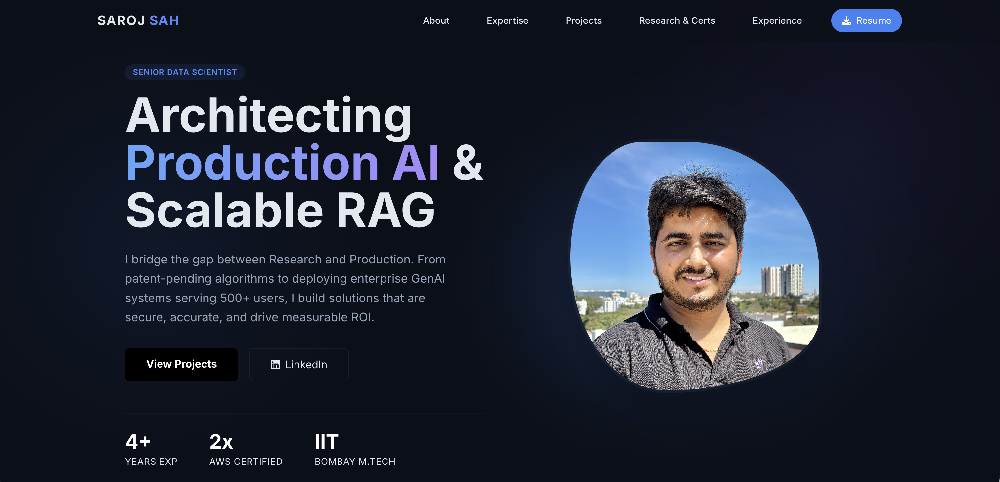

# Portfolio Website | Saroj Sah

A personal portfolio website showcasing my work as a **Senior Data Scientist** and **GenAI Solutions Architect**.

**Live Site:** [https://yourusername.github.io](https://saroj-shah.github.io/sarojsah.github.io/)

 

## 🚀 Overview
This portfolio was designed to highlight professional experience in **Generative AI**, **RAG Systems**, and **AWS Cloud Architecture**. It serves as a central hub for my projects, publications, and resume.

## 🛠️ Tech Stack
*   **Frontend:** HTML5, Tailwind CSS (CDN)
*   **Icons:** FontAwesome
*   **Animations:** AOS (Animate On Scroll) Library
*   **Hosting:** GitHub Pages

## ✨ Features
*   **Responsive Design:** Fully optimized for Mobile, Tablet, and Desktop.
*   **Glassmorphism UI:** Modern, dark-themed aesthetic with neural network background effects.
*   **Performance:** Lightweight, no-build setup using Tailwind CDN for fast loading.
*   **Accessibility:** Semantic HTML structure.

## 📂 Structure
```text
/
├── index.html      # Main entry point
├── profile.JPG     # Profile image
├── resume.pdf      # Downloadable Resume
└── README.md       # Documentation